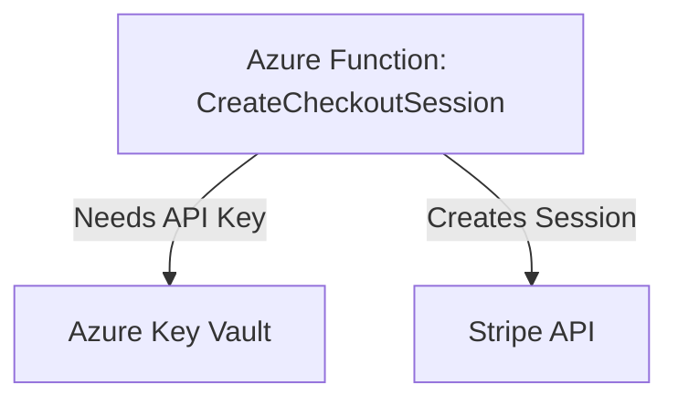

# serverless_stripe

A serverless payment session endpoint for Stripe supporting both Azure Functions and AWS Lambda.

## Project Intent
This project demonstrates how to build cloud-agnostic serverless endpoints for Stripe checkout sessions, with secure API key management using cloud-native secrets services. It is designed for multi-cloud deployments and best practices in serverless payments.

## Azure Function: Stripe Checkout Session

- **Purpose:** Exposes an HTTP endpoint to create Stripe checkout sessions for a cart of products.
- **API:** Accepts a POST request with cart items, currency, success/cancel URLs.
- **Security:** Retrieves the Stripe API key securely from Azure Key Vault at runtime.
- **Dependencies:**
  - Azure Functions .NET Isolated Worker
  - Azure.Security.KeyVault.Secrets
  - Azure.Identity
  - Stripe.NET

### How it works
1. Receives a POST request with cart details.
2. Fetches Stripe API key from Azure Key Vault.
3. Creates a Stripe checkout session and returns the session URL.

### Mermaid Diagram: Azure Function Dependency


## Setup
- Configure environment variables:
  - `KEY_VAULT_URL`: URL of your Azure Key Vault
  - `STRIPE_SECRET_NAME`: Name of the secret containing your Stripe API key
- Install dependencies via `dotnet restore`

## Local Development & Testing

### Prerequisites
- .NET 8 SDK
- Azure CLI (for Key Vault access)
- Stripe account and API key
- (Optional) OpenTelemetry Collector for local telemetry testing

### Steps to Run Locally

1. **Install dependencies:**
   ```bash
   dotnet restore azure-function/StripeCheckoutFunction.csproj
   ```

2. **Set environment variables:**
   You can set these in your shell or in `local.settings.json` (for Azure Functions local runtime):
   ```json
   {
     "IsEncrypted": false,
     "Values": {
       "AzureWebJobsStorage": "UseDevelopmentStorage=true",
       "FUNCTIONS_WORKER_RUNTIME": "dotnetIsolated",
       "KEY_VAULT_URL": "https://<your-keyvault-name>.vault.azure.net/",
       "STRIPE_SECRET_NAME": "StripeApiKey"
     }
   }
   ```

3. **Start Azure Function locally:**
   ```bash
   cd azure-function
   func start
   ```
   Or with .NET CLI:
   ```bash
   dotnet run --project StripeCheckoutFunction.csproj
   ```

4. **Test Azure Key Vault locally:**
   - Login with Azure CLI: `az login`
   - Set up permissions for your local identity to access Key Vault:
     ```bash
     az keyvault set-policy --name <your-keyvault-name> --upn <your-email> --secret-permissions get list
     ```
   - Add your Stripe API key to Key Vault:
     ```bash
     az keyvault secret set --vault-name <your-keyvault-name> --name StripeApiKey --value <your-stripe-api-key>
     ```

5. **Send a test request:**
   Use curl or Postman:
   ```bash
   curl -X POST http://localhost:7071/api/CreateCheckoutSession \
     -H "Content-Type: application/json" \
     -d '{
       "items": [{"productName": "Test Product", "unitAmount": 1000, "quantity": 2}],
       "currency": "usd",
       "successUrl": "https://example.com/success",
       "cancelUrl": "https://example.com/cancel"
     }'
   ```

### Local Telemetry & OpenTelemetry Collector

- To test telemetry locally, run an OpenTelemetry Collector with OTLP receiver:
  ```bash
  docker run -p 4317:4317 -v $(pwd)/otel-collector-config.yaml:/etc/otelcol/config.yaml otel/opentelemetry-collector:latest
  ```
- Configure the collector to export to ElasticSearch, Prometheus, or Jaeger as needed.
- Grafana can be connected to these backends for visualization.

## AWS Lambda
- (To be implemented)

## Specs
- See `/specs` for API contracts and architecture docs.

## License
See `LICENSE` for details.
